# TeamCORE — model ERD (Active Record)

This diagram reflects **persisted models** under `app/models/` as of the current codebase. It is the engineering counterpart to the conceptual [domain map](../product/domain-map.md). **Workforce financial** tables (compensation / revenue / commission / draw, contractor charges, contractor settlement) appear in the same diagram (edges from **Engagement** / **Agency**). **Phase 5 payroll calendar foundations (TC‑23a)** add **AgencyPayrollConfiguration**, **PayrollExport**, and a global **PayrollEarningCode** catalog. **TC‑23** adds **DailyWorkedHour** (canonical one row per engagement per work date) and **WeeklyTimesheet** (weekly workflow container; **`approved_by`** snapshot on **User**). **Weekly timesheet approval audit** is **`WeeklyTimesheetApprovalEvent`** (append-only transitions). **TC‑25** adds agency‑scoped **`LeaveType`**, **`LeaveRequest`** / **`LeaveRequestDay`**, append‑only **`LeaveRequestApprovalEvent`**, optional **`LeaveBalance`** / **`LeaveBalanceAdjustment`** for balance‑tracked paid types; paid types map to **`PayrollEarningCode`** (**ADR‑0004**).

**Tenancy:** Almost every row is scoped to an **Agency**. **Users** attach to agencies via **UserAgency** (admin / ops identity is separate from **Party** identity).

**Modeling notes (TC-13–TC-19):** [workforce-financial-modeling.md](workforce-financial-modeling.md) (hub) · [compensation-financials.md](compensation-financials.md) · [contractor-charges.md](contractor-charges.md) · [contractor-settlement.md](contractor-settlement.md)

**Payroll calendar / periods (TC‑23a):** [ADR‑0002](../adr/adr-0002-payroll-period-and-workweek-foundations); **employee time tracking (TC‑23):** [ADR‑0003](../adr/adr-0003-employee-time-and-timesheet-approval-boundaries.md); roadmap notes under `docs/roadmap/phase-5-payroll-time-leave/`.

---

## Spine (agency → workforce → engagement)

Workforce participation is **Party → TeamMember → Engagement**. Operational placement and supervision hang off **Engagement**. Documents attach to **Engagement** / **TeamMember** (and optionally **Party**) with **DocumentType** + **DocumentRequirement** defining rules.

```mermaid
erDiagram
  Agency ||--o{ Department : "org structure"
  Agency ||--o{ Location : "org structure"
  Agency ||--o{ Team : "org structure"
  Agency ||--o{ Party : "identity"
  Agency ||--o{ TeamMember : "workforce"
  Agency ||--o{ Engagement : "relationship spine"
  Agency ||--o{ PartyRelationship : "party graph"
  Agency ||--o{ DocumentType : "compliance catalog"
  Agency ||--o{ DocumentRequirement : "rules"
  Agency ||--o{ DocumentRecord : "artifacts"
  Agency ||--o{ UserAgency : "admin users"
  Agency ||--|| AgencyPayrollConfiguration : "payroll calendar TC-23a"

  User ||--o{ UserAgency : ""
  UserAgency }o--|| Agency : ""
  UserAgency }o--|| User : ""

  Department }o--o| Department : "parent (single-level tree)"
  Department ||--o{ Team : ""

  Location ||--o{ Team : ""

  Team }o--|| Agency : ""
  Team }o--o| Department : ""
  Team }o--o| Location : ""

  Party ||--o| PersonProfile : "1:1 if person"
  Party ||--o| OrganizationProfile : "1:1 if org"
  Party ||--o{ PartyContactMethod : ""
  Party ||--o{ TeamMember : ""

  TeamMember }o--|| Party : ""
  TeamMember }o--|| Agency : ""
  TeamMember ||--o{ Engagement : ""

  Engagement }o--|| Agency : ""
  Engagement }o--|| TeamMember : ""
  Engagement ||--o{ EngagementOrganizationPlacement : "dept/loc/team over time"
  Engagement ||--o{ EngagementSupervisionAssignment : "supervised side"
  Engagement ||--o{ EngagementSupervisionAssignment : "supervisor side"
  Engagement ||--o{ DocumentRecord : ""
  Engagement ||--o{ CompensationPlanAssignment : "compensation"
  Engagement ||--o{ RevenueInput : "compensation"
  Engagement ||--o{ CommissionCalculation : "compensation"
  Engagement ||--o| CommissionDrawBalance : "compensation · draw"
  Engagement ||--o{ DrawBalanceEvent : "compensation"
  Engagement ||--o{ ContractorCharge : "charges"
  Engagement ||--o{ ContractorSettlementLine : "settlement"
  Engagement ||--o{ DailyWorkedHour : "TC-23 daily worked hours"
  Engagement ||--o{ WeeklyTimesheet : "weekly workflow"
  Engagement ||--o{ LeaveRequest : "TC-25 leave"
  Engagement ||--o{ LeaveBalance : "TC-25 balance-tracked"

  WeeklyTimesheet }o--o| User : "approved_by"
  WeeklyTimesheet ||--o{ WeeklyTimesheetApprovalEvent : "approval audit"

  WeeklyTimesheetApprovalEvent }o--|| User : "actor"

  Agency ||--o{ LeaveType : "TC-25 catalog"
  LeaveType }o--o| PayrollEarningCode : "paid leave earning map"
  LeaveRequest }o--|| LeaveType : ""
  LeaveRequest }o--o| User : "reviewed_by"
  LeaveRequest ||--o{ LeaveRequestDay : ""
  LeaveRequest ||--o{ LeaveRequestApprovalEvent : ""
  LeaveRequestApprovalEvent }o--|| User : "actor"
  LeaveBalance }o--|| LeaveType : ""
  LeaveBalance ||--o{ LeaveBalanceAdjustment : ""
  LeaveBalanceAdjustment }o--|| User : "adjusted_by"

  Agency ||--o{ PayPeriod : "compensation"
  Agency ||--o{ CompensationPlan : "compensation"
  Agency ||--o{ CompensationPlanAssignment : "compensation"
  Agency ||--o{ RevenueInput : "compensation"
  Agency ||--o{ CommissionCalculation : "compensation"
  Agency ||--o{ CommissionDrawBalance : "compensation"
  Agency ||--o{ DrawBalanceEvent : "compensation"
  Agency ||--o{ ContractorCharge : "charges"
  Agency ||--o{ ContractorChargeWaiver : "charges"
  Agency ||--o{ ContractorChargeRecovery : "charges"
  Agency ||--o{ ContractorSettlementRun : "settlement"
  Agency ||--o{ ContractorSettlementLine : "settlement"

  CompensationPlan ||--o{ CompensationPlanAssignment : "compensation"

  PayPeriod ||--o{ RevenueInput : "compensation"
  PayPeriod ||--o{ CommissionCalculation : "compensation"
  PayPeriod ||--o{ PayrollExport : "export tracking TC-23a"
  PayPeriod }o--o| User : "closed_by"

  PayrollExport }o--o| User : "exported_by"

  RevenueInput ||--o{ CommissionCalculation : "compensation"
  CommissionCalculation ||--o{ DrawBalanceEvent : "compensation"

  ContractorSettlementRun ||--o{ ContractorSettlementLine : "settlement"
  ContractorSettlementRun ||--o{ ContractorSettlementRunEvent : "settlement"

  ContractorSettlementLine ||--o{ ContractorSettlementLineRevenueInput : "settlement lineage"
  RevenueInput ||--o{ ContractorSettlementLineRevenueInput : "settlement"
  ContractorSettlementLine ||--o{ ContractorSettlementLineCommissionCalculation : "settlement lineage"
  CommissionCalculation ||--o{ ContractorSettlementLineCommissionCalculation : "settlement"

  ContractorCharge ||--o{ ContractorChargeWaiver : "charges"
  ContractorCharge ||--o{ ContractorChargeRecovery : "charges"
  ContractorSettlementLine ||--o{ ContractorChargeRecovery : "settlement (optional)"

  EngagementOrganizationPlacement }o--|| Agency : ""
  EngagementOrganizationPlacement }o--|| Engagement : ""
  EngagementOrganizationPlacement }o--o| Department : ""
  EngagementOrganizationPlacement }o--o| Location : ""
  EngagementOrganizationPlacement }o--o| Team : ""

  EngagementSupervisionAssignment }o--|| Agency : ""
  EngagementSupervisionAssignment }o--|| Engagement : "supervised"
  EngagementSupervisionAssignment }o--|| Engagement : "supervisor_engagement"

  DocumentType }o--|| Agency : ""
  DocumentType ||--o{ DocumentRequirement : ""
  DocumentType ||--o{ DocumentRecord : ""

  DocumentRequirement }o--|| Agency : ""
  DocumentRequirement }o--|| DocumentType : ""

  DocumentRecord }o--|| Agency : ""
  DocumentRecord }o--|| DocumentType : ""
  DocumentRecord }o--o| TeamMember : ""
  DocumentRecord }o--o| Engagement : ""
  DocumentRecord }o--o| Party : ""
  DocumentRecord }o--o| User : "verified_by"

  PartyRelationship }o--|| Agency : ""
  PartyRelationship }o--|| Party : "source_party"
  PartyRelationship }o--|| Party : "target_party"

  PayrollEarningCode {
    string code
    string category
    string name
    int position
  }
```

---

## How domains intersect (quick reference)

| Conceptual domain | Primary models |
| --- | --- |
| **Agency** | `Agency`, `UserAgency`, `AgencyPayrollConfiguration` |
| **Organization (structure)** | `Department`, `Location`, `Team` |
| **Party / identity** | `Party`, `PersonProfile`, `OrganizationProfile`, `PartyContactMethod` |
| **Party graph** | `PartyRelationship` (same agency; source/target parties) |
| **Team member** | `TeamMember` (party within agency) |
| **Engagement** | `Engagement` (relationship type + lifecycle status) |
| **Placement & supervision** | `EngagementOrganizationPlacement`, `EngagementSupervisionAssignment` |
| **Documents & compliance** | `DocumentType`, `DocumentRequirement`, `DocumentRecord` |
| **Compensation (catalog & assignment)** | `CompensationPlan`, `CompensationPlanAssignment` |
| **Pay periods & revenue** | `PayPeriod`, `RevenueInput`, `PayrollExport` |
| **Employee time (TC‑23)** | `DailyWorkedHour`, `WeeklyTimesheet` |
| **Employee leave (TC‑25)** | `LeaveType`, `LeaveRequest`, `LeaveRequestDay`, `LeaveRequestApprovalEvent`, `LeaveBalance`, `LeaveBalanceAdjustment` |
| **Payroll earning vocabulary** | `PayrollEarningCode` (global seeded catalog; no agency FK) |
| **Commission & draw** | `CommissionCalculation`, `CommissionDrawBalance`, `DrawBalanceEvent` |
| **Contractor charges** | `ContractorCharge`, `ContractorChargeWaiver`, `ContractorChargeRecovery` |
| **Contractor settlement** | `ContractorSettlementRun`, `ContractorSettlementLine`, join tables, `ContractorSettlementRunEvent` |
| **Team360 / reporting** | No Team360 table — read models aggregate domain tables |
| **Admin auth** | `User` (+ `has_secure_password`), `UserAgency`; **Pay period lifecycle** may reference `User` via `PayPeriod#closed_by` and `PayrollExport#exported_by` |

---

## Notable constraints (behavior the ERD does not show)

- **Engagement** enforces relationship type vs **Party** kind (e.g. employee → person party).
- **DocumentRecord** requires at least one of **team_member** or **engagement**; **party** is optional; agency must align with those rows.
- **EngagementSupervisionAssignment** (MVP): supervisor engagement must be **active** **employee**.
- **Department** hierarchy: optional parent must be top-level (no deep trees in MVP).
- **DailyWorkedHour / WeeklyTimesheet (TC‑23):** canonical **one** daily worked-hour row per `engagement_id` + `work_date`; weekly timesheet unique per `engagement_id` + `week_start_on` with `week_end_on == week_start_on + 6 days`; workflow statuses `draft` / `submitted` / `approved` / `rejected` (approval transitions TC‑24‑owned); optional `approved_by` / `rejected_by` users.
- **Leave (TC‑25):** `LeaveRequest` statuses `draft` / `submitted` / `approved` / `rejected` / `cancelled`; daily allocation on `LeaveRequestDay`; paid `LeaveType` requires `payroll_earning_code_id`; balance rows only for balance‑tracked types; consume/restore on approve/cancel‑approved/reopen per **ADR‑0004** (reject does **not** restore balance that was never consumed).
- **PayPeriod (TC‑23a):** at most one non‑overlapping date range per agency; persisted `start_on`/`end_on` cannot change after save; **closed** periods reject updates (`status_was == closed`). Closure validation overrides apply only to pending stub validators — permissions and immutability still enforced.
- **AgencyPayrollConfiguration:** one row per agency (single payroll frequency MVP); weekly/biweekly/monthly require `pay_schedule_anchor_on`; semimonthly halves ignore anchor.
- **Workforce financials:** Minimum commission draw recovery is **employee-only**; **contractor settlement** applies to `individual_contractor` and `contractor_organization` engagements only (**subcontractor** excluded in MVP). Net contractor settlement is non-negative in MVP. Hybrid settlement lineage: lines store totals plus join rows to revenue, commission calcs, and charge recoveries.

---

## Rendering

GitHub renders Mermaid in markdown. In other viewers, paste the `erDiagram` block into [Mermaid Live Editor](https://mermaid.live).
