# TeamCORE — model ERD (Active Record)

This diagram reflects **persisted models** under `app/models/` as of the current codebase. It is the engineering counterpart to the conceptual [domain map](../product/domain-map.md). **Phase 4** financial tables (compensation, revenue, commission, contractor charges, contractor settlement) appear in the same diagram (edges from **Engagement** / **Agency**). Domains such as full payroll execution, time, and leave **do not** have dedicated tables yet unless they appear here.

**Tenancy:** Almost every row is scoped to an **Agency**. **Users** attach to agencies via **UserAgency** (admin / ops identity is separate from **Party** identity).

**Modeling notes:** [phase-4-modeling.md](phase-4-modeling.md)

---

## Spine (agency → workforce → engagement)

Workforce participation is **Party → TeamMember → Engagement**. Operational placement and supervision hang off **Engagement**. Documents attach to **Engagement** / **TeamMember** (and optionally **Party**) with **DocumentType** + **DocumentRequirement** defining rules.

```mermaid
erDiagram
  Agency ||--o{ Department : "org structure"
  Agency ||--o{ Location : "org structure"
  Agency ||--o{ Team : "org structure"
  Agency ||--o{ Party : "identity"
  Agency ||--o{ TeamMember : "workforce"
  Agency ||--o{ Engagement : "relationship spine"
  Agency ||--o{ PartyRelationship : "party graph"
  Agency ||--o{ DocumentType : "compliance catalog"
  Agency ||--o{ DocumentRequirement : "rules"
  Agency ||--o{ DocumentRecord : "artifacts"
  Agency ||--o{ UserAgency : "admin users"

  User ||--o{ UserAgency : ""
  UserAgency }o--|| Agency : ""
  UserAgency }o--|| User : ""

  Department }o--o| Department : "parent (single-level tree)"
  Department ||--o{ Team : ""

  Location ||--o{ Team : ""

  Team }o--|| Agency : ""
  Team }o--o| Department : ""
  Team }o--o| Location : ""

  Party ||--o| PersonProfile : "1:1 if person"
  Party ||--o| OrganizationProfile : "1:1 if org"
  Party ||--o{ PartyContactMethod : ""
  Party ||--o{ TeamMember : ""

  TeamMember }o--|| Party : ""
  TeamMember }o--|| Agency : ""
  TeamMember ||--o{ Engagement : ""

  Engagement }o--|| Agency : ""
  Engagement }o--|| TeamMember : ""
  Engagement ||--o{ EngagementOrganizationPlacement : "dept/loc/team over time"
  Engagement ||--o{ EngagementSupervisionAssignment : "supervised side"
  Engagement ||--o{ EngagementSupervisionAssignment : "supervisor side"
  Engagement ||--o{ DocumentRecord : ""
  Engagement ||--o{ CompensationPlanAssignment : "Phase 4"
  Engagement ||--o{ RevenueInput : "Phase 4"
  Engagement ||--o{ CommissionCalculation : "Phase 4"
  Engagement ||--o| CommissionDrawBalance : "Phase 4 employee draw"
  Engagement ||--o{ DrawBalanceEvent : "Phase 4"
  Engagement ||--o{ ContractorCharge : "Phase 4"
  Engagement ||--o{ ContractorSettlementLine : "Phase 4"

  Agency ||--o{ PayPeriod : "Phase 4"
  Agency ||--o{ CompensationPlan : "Phase 4"
  Agency ||--o{ CompensationPlanAssignment : "Phase 4"
  Agency ||--o{ RevenueInput : "Phase 4"
  Agency ||--o{ CommissionCalculation : "Phase 4"
  Agency ||--o{ CommissionDrawBalance : "Phase 4"
  Agency ||--o{ DrawBalanceEvent : "Phase 4"
  Agency ||--o{ ContractorCharge : "Phase 4"
  Agency ||--o{ ContractorChargeWaiver : "Phase 4"
  Agency ||--o{ ContractorChargeRecovery : "Phase 4"
  Agency ||--o{ ContractorSettlementRun : "Phase 4"
  Agency ||--o{ ContractorSettlementLine : "Phase 4"

  CompensationPlan ||--o{ CompensationPlanAssignment : "Phase 4"

  PayPeriod ||--o{ RevenueInput : "Phase 4"
  PayPeriod ||--o{ CommissionCalculation : "Phase 4"

  RevenueInput ||--o{ CommissionCalculation : "Phase 4"
  CommissionCalculation ||--o{ DrawBalanceEvent : "Phase 4"

  ContractorSettlementRun ||--o{ ContractorSettlementLine : "Phase 4"
  ContractorSettlementRun ||--o{ ContractorSettlementRunEvent : "Phase 4"

  ContractorSettlementLine ||--o{ ContractorSettlementLineRevenueInput : "Phase 4 lineage"
  RevenueInput ||--o{ ContractorSettlementLineRevenueInput : "Phase 4"
  ContractorSettlementLine ||--o{ ContractorSettlementLineCommissionCalculation : "Phase 4 lineage"
  CommissionCalculation ||--o{ ContractorSettlementLineCommissionCalculation : "Phase 4"

  ContractorCharge ||--o{ ContractorChargeWaiver : "Phase 4"
  ContractorCharge ||--o{ ContractorChargeRecovery : "Phase 4"
  ContractorSettlementLine ||--o{ ContractorChargeRecovery : "Phase 4 optional FK"

  EngagementOrganizationPlacement }o--|| Agency : ""
  EngagementOrganizationPlacement }o--|| Engagement : ""
  EngagementOrganizationPlacement }o--o| Department : ""
  EngagementOrganizationPlacement }o--o| Location : ""
  EngagementOrganizationPlacement }o--o| Team : ""

  EngagementSupervisionAssignment }o--|| Agency : ""
  EngagementSupervisionAssignment }o--|| Engagement : "supervised"
  EngagementSupervisionAssignment }o--|| Engagement : "supervisor_engagement"

  DocumentType }o--|| Agency : ""
  DocumentType ||--o{ DocumentRequirement : ""
  DocumentType ||--o{ DocumentRecord : ""

  DocumentRequirement }o--|| Agency : ""
  DocumentRequirement }o--|| DocumentType : ""

  DocumentRecord }o--|| Agency : ""
  DocumentRecord }o--|| DocumentType : ""
  DocumentRecord }o--o| TeamMember : ""
  DocumentRecord }o--o| Engagement : ""
  DocumentRecord }o--o| Party : ""
  DocumentRecord }o--o| User : "verified_by"

  PartyRelationship }o--|| Agency : ""
  PartyRelationship }o--|| Party : "source_party"
  PartyRelationship }o--|| Party : "target_party"
```

---

## How domains intersect (quick reference)

| Conceptual domain | Primary models |
| --- | --- |
| **Agency** | `Agency`, `UserAgency` |
| **Organization (structure)** | `Department`, `Location`, `Team` |
| **Party / identity** | `Party`, `PersonProfile`, `OrganizationProfile`, `PartyContactMethod` |
| **Party graph** | `PartyRelationship` (same agency; source/target parties) |
| **Team member** | `TeamMember` (party within agency) |
| **Engagement** | `Engagement` (relationship type + lifecycle status) |
| **Placement & supervision** | `EngagementOrganizationPlacement`, `EngagementSupervisionAssignment` |
| **Documents & compliance** | `DocumentType`, `DocumentRequirement`, `DocumentRecord` |
| **Compensation (Phase 4)** | `CompensationPlan`, `CompensationPlanAssignment` |
| **Pay periods & revenue (Phase 4)** | `PayPeriod`, `RevenueInput` |
| **Commission & draw (Phase 4)** | `CommissionCalculation`, `CommissionDrawBalance`, `DrawBalanceEvent` |
| **Contractor charges (Phase 4)** | `ContractorCharge`, `ContractorChargeWaiver`, `ContractorChargeRecovery` |
| **Contractor settlement (Phase 4)** | `ContractorSettlementRun`, `ContractorSettlementLine`, join tables, `ContractorSettlementRunEvent` |
| **Team360 / reporting** | No Team360 table — read models aggregate domain tables |
| **Admin auth** | `User` (+ `has_secure_password`), `UserAgency` |

---

## Notable constraints (behavior the ERD does not show)

- **Engagement** enforces relationship type vs **Party** kind (e.g. employee → person party).
- **DocumentRecord** requires at least one of **team_member** or **engagement**; **party** is optional; agency must align with those rows.
- **EngagementSupervisionAssignment** (MVP): supervisor engagement must be **active** **employee**.
- **Department** hierarchy: optional parent must be top-level (no deep trees in MVP).
- **Phase 4:** Minimum commission draw recovery is **employee-only**; **contractor settlement** applies to `individual_contractor` and `contractor_organization` engagements only (**subcontractor** excluded in MVP). Net contractor settlement is non-negative in MVP. Hybrid settlement lineage: lines store totals plus join rows to revenue, commission calcs, and charge recoveries.

---

## Rendering

GitHub renders Mermaid in markdown. In other viewers, paste the `erDiagram` block into [Mermaid Live Editor](https://mermaid.live).
