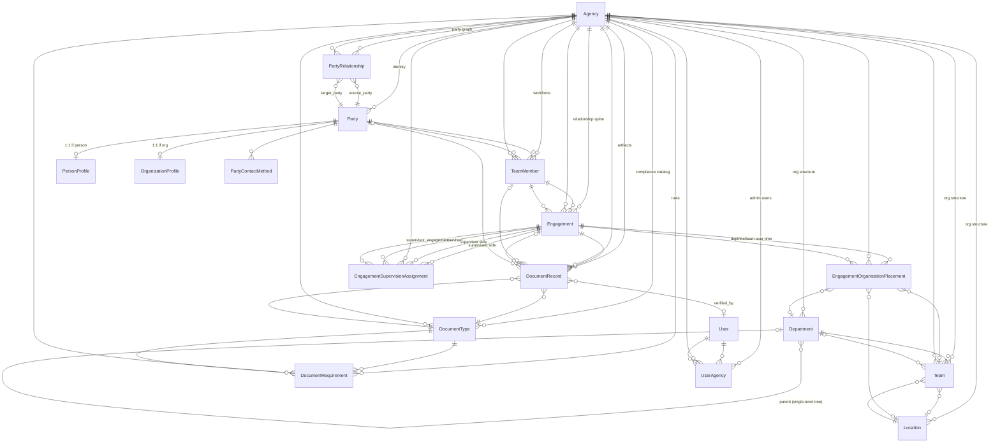

# TeamCORE — model ERD (Active Record)

This diagram reflects **persisted models** under `app/models/` as of the current codebase. It is the engineering counterpart to the conceptual [domain map](../product/domain-map.md): product domains like payroll, time, leave, and settlement **do not** have tables yet unless they appear here.

**Tenancy:** Almost every row is scoped to an **Agency**. **Users** attach to agencies via **UserAgency** (admin / ops identity is separate from **Party** identity).

---

## Spine (agency → workforce → engagement)

Workforce participation is **Party → TeamMember → Engagement**. Operational placement and supervision hang off **Engagement**. Documents attach to **Engagement** / **TeamMember** (and optionally **Party**) with **DocumentType** + **DocumentRequirement** defining rules.

---

## How domains intersect (quick reference)

| Conceptual domain | Primary models |
| --- | --- |
| **Agency** | `Agency`, `UserAgency` |
| **Organization (structure)** | `Department`, `Location`, `Team` |
| **Party / identity** | `Party`, `PersonProfile`, `OrganizationProfile`, `PartyContactMethod` |
| **Party graph** | `PartyRelationship` (same agency; source/target parties) |
| **Team member** | `TeamMember` (party within agency) |
| **Engagement** | `Engagement` (relationship type + lifecycle status) |
| **Placement & supervision** | `EngagementOrganizationPlacement`, `EngagementSupervisionAssignment` |
| **Documents & compliance** | `DocumentType`, `DocumentRequirement`, `DocumentRecord` |
| **Team360 / reporting** | No separate tables — read models aggregate the above |
| **Admin auth** | `User` (+ `has_secure_password`), `UserAgency` |

---

## Notable constraints (behavior the ERD does not show)

- **Engagement** enforces relationship type vs **Party** kind (e.g. employee → person party).
- **DocumentRecord** requires at least one of **team_member** or **engagement**; **party** is optional; agency must align with those rows.
- **EngagementSupervisionAssignment** (MVP): supervisor engagement must be **active** **employee**.
- **Department** hierarchy: optional parent must be top-level (no deep trees in MVP).

---

## Rendering

GitHub renders Mermaid in markdown. In other viewers, paste the `erDiagram` block into [Mermaid Live Editor](https://mermaid.live).
