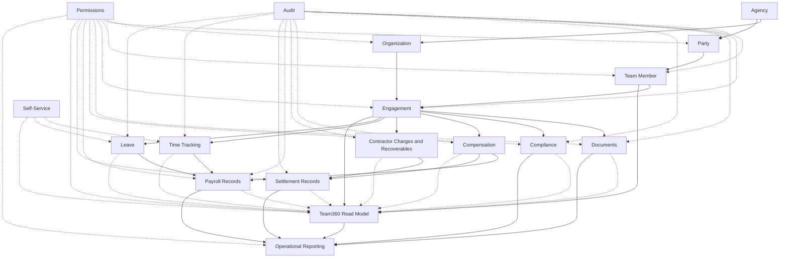

# TeamCORE Domain Map

## Purpose

This document maps the major TeamCORE product domains and their conceptual relationships before detailed data modeling.

It is intended to provide a shared planning picture for product, engineering, roadmap, issue writing, and future implementation work. It describes what each domain owns, what it depends on, what it feeds, and which areas belong to the MVP roadmap versus later scope.

This is **not** an ERD, database schema, or final bounded-context design.

---

## Decision handling model

Treat decisions as **three tiers**, not a single backlog: Tier 1 (lock before Phase 1 modeling), Tier 2 (define terms and product rules now, refine schema later), Tier 3 (register now, ADR/spike near implementation).

| Tier | Use for |
| --- | --- |
| **Tier 1** | Core schema/schema blockers immediately |
| **Tier 2** | Glossary clarity and roadmap language without freezing every implementation detail |
| **Tier 3** | Formal design when phase pressure warrants an ADR or spike |

Canonical entries, acceptance status, OD-IDs, and follow-ups live in **`open-decisions.md`**. Modeling notes referenced there (for example OD-001) extend this map without nesting full decision prose in both places.

---

## Design Principles

1. **Agency context comes first.** TeamCORE operates within the context of an agency or operating organization.

2. **Identity is separate from workforce participation.** A party identifies a person or organization. A team member represents a party’s participation in the agency’s workforce.

3. **Engagement is the operational spine.** Most downstream workflows depend on the engagement because the engagement defines whether the relationship is employee-based, contractor-based, active, pending, expired, or otherwise status-controlled.

4. **Employee and contractor workflows must remain distinct.** Employees generally flow through time, leave, and payroll input workflows. Contractors generally flow through compensation, charges, recoverables, draw recovery, and settlement workflows.

5. **Team360 is a read model, not the source of truth.** Team360 aggregates and presents information owned by other domains.

6. **Permissions and audit are cross-cutting concerns.** They apply across domains and should be considered throughout the roadmap, even if final hardening occurs later.

7. **Compliance support is not legal determination.** TeamCORE tracks configured requirements, documents, readiness, missing items, expirations, and classification-supporting records. It does not make final legal determinations unless a later approved scope explicitly adds that capability.

---

## Canonical Domain List

| Domain | What it owns |
|---|---|
| **Agency** | The top-level operating context for TeamCORE data, configuration, workforce records, reporting, and permissions. |
| **Organization** | Internal agency structure and placement **vocabulary** — departments, locations, teams; **reporting-line** concepts, supervisory concepts, authority-structure concepts. **Concrete Phase 1 (TC‑01) models** are **`Department`**, **`Location`**, **`Team`** on **`Agency`** — no polymorphic **`Organization`** table; see **`domain/organization.md`**. Engagement placement and supervision are **specified conceptually**, **persisted from TC‑03** onward. |
| **Party** | Identity records for people and organizations the agency interacts with, including individuals, contractor organizations, vendors, and related contacts. |
| **Team Member** | Workforce participant profile linked to a party and used by TeamCORE operational workflows. |
| **Engagement** | Employment or contractor relationship between a team member and the agency, including lifecycle, status, relationship type, supervisor, placement, renewal, and expiry semantics. |
| **Documents** | Document types; uploaded artifacts and file references; document metadata; versions; and expiration dates associated with artifact records. |
| **Compliance** | Requirement sets, completeness checks, readiness interpretation; missing/expired/expiring-soon indicators; activation readiness; and contractor classification support records. |
| **Team360** | Permission-aware aggregated profile/read model for one team member, backed by authoritative records in other domains. |
| **Operational Reporting** | Filterable lists, summaries, exception views, and drill-through reporting surfaces. |
| **Compensation** | What the agency may owe a team member, including salary, hourly rate, commission rate, compensation plan assignment, draws, and draw recovery rules. |
| **Contractor Charges and Recoverables** | What a contractor may owe the agency, including fees, pass-through costs, recoverable balances, charge statuses, and waiver history. |
| **Payroll Records** | Employee payroll inputs, payroll exports, payroll imports, manual payroll result entry, payroll run references, and payroll result history. |
| **Settlement Records** | Contractor settlement runs, settlement exports, settlement imports, manual settlement result entry, settlement status, and settlement result history. |
| **Time Tracking** | Employee working time capture, timeclock records, timesheets, timesheet approval, and time summaries. |
| **Leave** | Employee leave requests, leave types, approvals, manual or calculated balances, and leave summaries. |
| **Self-Service** | Limited team member-facing workflows, initially focused on employee time entry, timesheet submission, leave requests, and limited profile visibility. |
| **Permissions** | Cross-cutting authorization rules controlling who can view, create, update, approve, verify, waive, import, export, or audit records. |
| **Audit** | Cross-cutting lifecycle and change history for sensitive records, workflow actions, approvals, verifications, waivers, imports, exports, and status changes. |

---

## Conceptual Spine

TeamCORE’s core model should generally follow this conceptual spine:

```text
Agency
  ├─ Organization Structure
  │    ├─ Department
  │    ├─ Location
  │    └─ Team
  └─ Party
       ↓
     Team Member
       ↓
     Engagement
       ↓
     Operational Domains
       ↓
     Team360 / Reporting
```

**Organization structure** and **party identity** both belong to agency context (**Agency → Organization** vs **Agency → Party** in the diagram below are separate paths).

**Engagement** is where workforce participation becomes operational for relationship type, status, placements, workflows, payroll vs settlement rails, Team360 sourcing, etc.

### Agency

The agency is the top-level operating context.

It may eventually support tenant-like behavior, but this domain map does not assume a final multi-tenancy implementation.

---

### Organization

Organization describes the agency’s internal structure.

**Implementation (TC-01 / OD-011 / ADR-0001):** The **domain** “Organization” maps to concrete models **`Department`**, **`Location`**, and **`Team`**, each belonging to an **`Agency`**. There is **no** polymorphic `Organization` Active Record type; see [`domain/organization.md`](../domain/organization.md).

It answers questions such as:

* Which department does this engagement belong to?
* Which location is associated with the engagement?
* Which team is responsible for this person or relationship?
* Who supervises or approves the relevant workflow?
* Which authority structure applies?

---

### Party

Party identifies the person or organization.

A party may be:

* An individual employee candidate
* An individual contractor
* A contractor organization
* A subcontractor
* A related contact
* A vendor-like organization
* Another relevant person or organization

Party is the identity layer. It should not, by itself, determine employee or contractor workflow behavior.

Implementation and TC-02 rules: [`party-team-member.md`](../domain/party-team-member.md).

### Team Member

Team Member represents workforce participation.

A team member is linked to a party and is the operational profile used by TeamCORE when that party participates in the agency’s workforce.

A party may exist before becoming a team member. A team member should normally be linked to one party.

Data model (**TC-02**): [`party-team-member.md`](../domain/party-team-member.md).

---

### Engagement

Engagement defines the relationship between the agency and the team member.

**TC-03 data model:** [`../domain/engagement.md`](../domain/engagement.md).  
**TC-04 policy:** status meanings and consumer contract — [`../domain/engagement-status.md`](../domain/engagement-status.md).

The engagement determines:

* Whether the relationship is employment-based or contractor-based
* Which status model applies
* Which documents may be required
* Which compensation or settlement workflows apply
* Whether time and leave workflows apply
* Whether payroll input or contractor settlement applies
* Which Team360 panels are relevant
* **Organization placement context** (**department**, **location**, **team**) and **related** supervisor / reporting-line context — see **§ Engagement and Organization Placement**

**Authority** is **not** “where” an engagement sits: it defines **who may approve, waive, verify**, etc., and **may consume** placement and reporting-line data without being a placement field (see **`../domain/organization.md`** — Authority structure).

Engagement is the main operational anchor for downstream domains.

---

## High-Level Dependency Diagram



Diagram edges represent conceptual dependency and information flow. They do **not** prescribe database foreign keys, Rails namespaces, service boundaries, or table structure.

**Diagram note (`Organization` → `Engagement`):** Organization **influences** engagement via **placement** (**department**, **location**, **team**) and **supervision / reporting-line** assignments. **Persistent** placement and supervision tables attach to **Engagement** beginning in **TC‑03**. **TC‑01** establishes only the **`Agency`**, **`Department`**, **`Location`**, **`Team`** substrate (**[`domain/organization.md`](../domain/organization.md)**).

---

## Domain Relationships

### Agency and Organization

The agency is the top-level operating entity using TeamCORE.

**Organization** is **domain vocabulary** for internal structure (placement dimensions, supervisory concepts, authority concepts **as product language**)—see Canonical Domain List. **Operational structure** tables in MVP are **`Department`**, **`Location`**, **`Team`**, anchored on **`Agency`** (**ADR-0001**).

Agency-level configuration may eventually affect:

* Available departments
* Available locations
* Available teams
* Role and permission rules
* Document requirement templates
* Compensation plan availability
* Payroll and settlement export formats
* Reporting filters

---

### Party, Team Member, and Engagement

These three concepts should remain distinct.

| Concept         | Meaning                                                             |
| --------------- | ------------------------------------------------------------------- |
| **Party**       | The person or organization identity.                                |
| **Team Member** | The workforce participant profile.                                  |
| **Engagement**  | The specific employment or contractor relationship with the agency. |

A party may exist without an active team member record.

A team member may have **multiple engagements over time**.

**Cardinality (OD-002):** Normally at most **one active engagement per relationship type** at a time. Simultaneous **employee plus contractor** relationships are **not** default and require explicit administrative allowance or later scope. Contractor-overlap nuances may later be scoped by contract, program, or client.

An engagement determines which workflows apply.

Example:

```text
Party: Jane Smith
Team Member: Jane Smith as a workforce participant in TeamCORE
Engagement 1: Employee engagement, active
Engagement 2: Prior contractor engagement, ended
```

**Status modeling (OD-003):** Status is owned by **Engagement** under a **relationship type** (`employee` | `contractor`) with **type-specific** allowed statuses and transitions—not separate top-level “employee status” and “contractor status” domains.

**Subcontractors (OD-004):** MVP prefers **related party** linkage; promote to **Team Member** (+ engagement as needed) when the agency requires direct docs/compliance tracking, settlement, or Team360. See **`open-decisions.md`** for the promotion checklist.

---

### Engagement and Organization Placement

An engagement may be placed within the organization structure **using department, location, and team**.

**Placement may specify:**

* Department  
* Location  
* Team  

**Related engagement organization context may also reference (persisted primarily with engagement lifecycle — TC‑03):**

* Supervisor  
* Reporting line (**[`domain/organization.md`](../domain/organization.md)** § Reporting line).

**Authority structure** is **not** a placement field: it defines **controlled-action permissions** and **may use** placement and reporting-line facts as inputs in workflow and permission engines (**later phases**).

This framing allows TeamCORE to answer:

* Where does this person work? (**placement**)  
* Who supervises this engagement? (**supervision**)  
* Which approvals apply? (**authority**, distinct from geography)  
* Which organizational filters include this engagement? (**reporting**)

---

### Engagement and Documents / Compliance

Documents and compliance primarily attach to the engagement, though some requirements may also attach to the party, team member, role, location, contractor type, or agency policy.

Examples:

* A contractor agreement may be required for a contractor engagement.
* A license may be required for a particular role or location.
* A tax form may be required for a contractor or employee.
* A policy acknowledgment may be required for all active team members.

**Compliance** owns configured **rules** and **readiness interpretation**, including signals for missing, expired, or expiring requirements.

**Documents** owns **uploaded artifacts** (or authoritative file references), **document-instance metadata**, **versions**, **expiration tracking on the artifact record**, and the **verification action** tied to evaluating a submission.

**Boundary — verification:** Verification **reviews a document artifact** against policy (often surfaced from document-admin UX). **Compliance** **consumes** verification outcomes to calculate **activation readiness**, requirement satisfaction, exception handling, or obligation state—avoid treating verification as wholly owned by either side alone without this split (**OD-005**, Phase 2 implementation detail).

**TC-06 implementation hub:** [`documents-compliance.md`](../domain/documents-compliance.md) — types, requirements, records, **`Documents::ReadinessEvaluator`**, persisted vs derived status, subcontractor applicability. **TC-07 document alerts (virtual, read-time):** [`document-alerts.md`](../domain/document-alerts.md). **TC-08 document verification (review actions):** [`document-verification.md`](../domain/document-verification.md).

---

Compensation describes what the agency may owe the team member under the engagement.

Examples:

* Salary for an employment engagement
* Hourly rate for an employment engagement
* Flat-rate commission for a contractor engagement
* Draw arrangement for a contractor engagement
* Commission plan assignment for a contractor engagement

Compensation may feed payroll records or settlement records depending on the engagement type.

---

### Contractor Charges and Recoverables

Contractor charges and recoverables describe what a contractor may owe the agency.

Examples:

* Fees
* Pass-through costs
* Recoverable expenses
* Advances
* Repayable draws
* Adjustments
* Waived charges

This domain is separate from compensation because it represents the opposite direction of obligation.

```text
Compensation:
Agency → Team Member

Contractor Charges:
Contractor → Agency
```

Contractor charges may be applied to contractor settlement records.

---

### Payroll Records and Settlement Records

Payroll records and settlement records may share a similar batch-oriented pattern, but they should remain conceptually distinct.

Use canonical vocabulary (**OD-007**, **OD-008**):

| Term | Meaning |
| --- | --- |
| **Payroll input** | Data TeamCORE assembles **before** external payroll processing. |
| **Payroll export** | File or package sent **out** for processing. |
| **Payroll run** | The **processing cycle or batch identity** (often external/manual in MVP). |
| **Payroll result** | Outcome recorded **after** processing. |
| **Contractor settlement** | End-to-end **workflow** context for contractor pay/recovery (not synonymous with “a single row”). |
| **Settlement run** | Settlement **batch or cycle**. |
| **Settlement calculation** | Derived payable/recovery amounts before finalization. |
| **Settlement result** | Final recorded outcome. |

Common pattern:

```text
Prepare input / calculation → Export → Processing (often external)
→ Import or manual entry → Record result → History & reporting
```

Domain split:

| Domain | Applies To | Owns primarily |
| --- | --- | --- |
| **Payroll Records** | Employees | Payroll **inputs**, **exports**, **imports**, **payroll runs** references, **payroll results** history. |
| **Settlement Records** | Contractors | **Settlement runs**, calculations artifacts (as stored), settlement **exports/imports**, **settlement results**. |

Ownership between **Compensation**, **Charges**, and **Settlement** for draw recovery follows **OD-012** (`open-decisions.md`): Compensation defines draws; balances may surface in Charges; Settlement **applies** recovery and records outcomes.

TeamCORE prepares payroll/settlement artifacts and stores results without becoming the payroll processor (MVP). TeamCORE supports contractor settlements without pretending to be a full accounting/AP suite.

---

### Time Tracking, Leave, and Payroll

Time tracking and leave are employee-oriented in the MVP.

Time and leave may feed payroll input workflows after review or approval.

Examples:

* Employee clocks in and out.
* Employee submits a timesheet.
* Authorized user approves the timesheet.
* Employee submits a leave request.
* Leave request is approved or auto-approved based on leave type.
* Approved time and reviewed leave are included in payroll input.

Contractors do not participate in time and leave workflows in the MVP unless later scope changes.

---

### Team360

Team360 is the unified profile/read model for a team member.

It may display:

* Identity
* Contact details
* Organization placement
* Engagement history
* Status
* Compliance readiness
* Required documents
* Compensation summary
* Contractor charges
* Settlement history
* Time and leave summaries
* Payroll input/result summaries
* Audit history

Team360 should not duplicate ownership of source data.

Instead:

```text
Owning domain → Team360 panel
```

Examples:

* Documents owns document records.
* Compliance owns readiness state.
* Compensation owns compensation plan assignment.
* Payroll Records owns payroll results.
* Settlement Records owns settlement results.
* Team360 displays relevant panels from each domain.

---

### Operational Reporting

Operational reporting provides lists and summaries used to monitor work.

Examples:

* Active team members
* Pending engagements
* Missing documents
* Expiring documents
* Unverified documents
* Not-ready engagements
* Pending timesheets
* Pending leave requests
* Open contractor charges
* Pending settlements
* Payroll inputs awaiting export
* Imports with errors

Operational reporting should support drill-through to Team360 or the authoritative source record.

---

### Self-Service

Self-service is limited in the MVP.

Initial self-service may include employee-facing actions such as:

* Clocking in or out
* Entering time
* Submitting timesheets
* Requesting leave
* Viewing limited profile or workflow information

Self-service does not imply a full employee portal, contractor portal, or manager portal unless later scope expands it.

---

### Permissions

Permissions control who can see or act on TeamCORE records.

For MVP assumptions (**OD-009**), default to role-based checks, coarse domain/action permissions, Team360 panel gates, workflow action checks, and light org/team scoping—not full field-level security unless a regulated field explicitly requires it later.

Permission rules may apply to:

* Team360 panel visibility
* Document upload
* Document verification
* Compliance readiness review
* Contractor charge waiver
* Timesheet approval
* Leave approval
* Payroll export/import
* Settlement export/import
* Manual result entry
* Audit history visibility

Permissions are cross-cutting and should be considered in every phase, even if final permission hardening occurs in Phase 6.

---

### Audit

Audit history records important changes, lifecycle events, decisions, approvals, verifications, waivers, imports, exports, and result entries. Target categories and fidelity levels mirror **OD-010** (`open-decisions.md`).

Audit should help answer:

* What changed?
* Who changed it?
* When did it change?
* Why did it change, if a reason was required?
* Which record or workflow did the change affect?

Audit is cross-cutting and should be designed early enough that sensitive workflows do not need to be retrofitted later.

---

## MVP Roadmap Domains by Phase

This section maps domains to the current TeamCORE roadmap phases.

The original domain-map draft correctly identified a broad Phase 1/MVP universe, but the roadmap separates the work into staged phases. The phase mapping below should be used for milestone and issue planning. The original draft also correctly described Team360 as a permission-aware aggregated presentation backed by authoritative records in other domains. 

---

### Phase 0 — Product Framing and Domain Model

| Domain / Area          | Purpose                                           |
| ---------------------- | ------------------------------------------------- |
| Product framing        | Establish what TeamCORE is and is not.            |
| Glossary               | Stabilize terminology.                            |
| Domain map             | Define major domains and relationships.           |
| MVP scope              | Firm charter in **`mvp-scope.md`** (GH-36 / TC-scope).                             |
| Decision log           | Settled roadmap decisions in **`roadmap-decision-log.md`** (GH-37). |
| Open decision register | Resolve OD-items by tier; authoritative file **`open-decisions.md`**.         |

---

### Phase 1 — Core Identity, Organization, and Engagement Foundation

| Domain / Area                      | Purpose                                                                                      |
| ---------------------------------- | -------------------------------------------------------------------------------------------- |
| Agency                             | Establish top-level operating context.                                                       |
| Organization                       | Define departments, locations, teams, reporting lines, and authority structure.              |
| Party                              | Define person and organization identity records.                                             |
| Team Member                        | Define workforce participant profile.                                                        |
| Engagement                         | Define employment and contractor relationships.                                              |
| Status models                      | Define employee and contractor status behavior.                                              |
| Subcontractor relationship support | Decide how subcontractors relate to contractors, contractor organizations, and team members. |

Phase 1 must come before documents, Team360, compensation, payroll, settlement, time, and leave can be meaningful.

---

### Phase 2 — Documents, Compliance, and Activation Readiness

| Domain / Area                     | Purpose                                                       |
| --------------------------------- | ------------------------------------------------------------- |
| Documents                         | Configure document types and upload/verification workflow.    |
| Document requirements             | Define required documents by engagement or other rule.        |
| Compliance                        | Track missing, expired, and expiring-soon requirements.       |
| Activation readiness              | Signal whether required configured conditions are satisfied.  |
| Contractor classification support | Track supporting records without making legal determinations. |

---

### Phase 3 — Team360 MVP and Operational Reporting

| Domain / Area         | Purpose                                                          |
| --------------------- | ---------------------------------------------------------------- |
| Team360               | Create the unified profile view.                                 |
| Team360 panels        | Display identity, engagement, organization, and compliance data. |
| Operational reporting | Create filterable operational lists and exception views.         |
| Drill-through         | Allow reports to navigate to Team360 or source records.          |

Some Team360 panels may be placeholders until Phases 4 and 5 populate financial, time, leave, payroll, and settlement data.

---

### Phase 4 — Compensation, Contractor Charges, and Settlement Basics

| Domain / Area           | Purpose                                                    |
| ----------------------- | ---------------------------------------------------------- |
| Compensation            | Assign salary, hourly, or commission compensation plans.   |
| Revenue inputs          | Capture gross sales and commissionable revenue.            |
| Flat-rate commission    | Support MVP commission calculation.                        |
| Repayable draw recovery | Recover draws from future contractor settlements.          |
| Contractor charges      | Track fees, recoverables, balances, statuses, and waivers. |
| Settlement shell        | Create basic contractor settlement records.                |

Phase 4 depends on Engagement from Phase 1 and should update Team360 panels introduced in Phase 3.

---

### Phase 5 — Employee Time, Leave, and Payroll Input Workflows

| Domain / Area            | Purpose                                                              |
| ------------------------ | -------------------------------------------------------------------- |
| Time tracking            | Support employee-only working time capture.                          |
| Timesheets               | Support employee timesheet submission and approval.                  |
| Leave                    | Support employee leave requests, leave types, and balances.          |
| Payroll input            | Gather compensation, approved time, reviewed leave, and result data. |
| Payroll export/import    | Support generic CSV/XLSX file workflows.                             |
| Settlement export/import | Support contractor settlement export/import or result recording.     |
| Manual result entry      | Allow manual payroll or settlement result entry.                     |
| Limited self-service     | Allow employees to submit time and leave workflows.                  |

---

### Phase 6 — MVP Hardening, Permissions, Audit, and Release Readiness

| Domain / Area            | Purpose                                                     |
| ------------------------ | ----------------------------------------------------------- |
| Permission-aware Team360 | Restrict panels and data by role or permission.             |
| Permissions              | Harden access rules across sensitive workflows.             |
| Audit history            | Track lifecycle events and sensitive changes.               |
| Validation               | Stabilize data validation rules.                            |
| Import/export hardening  | Improve file validation, error handling, and result safety. |
| Release readiness        | Prepare the MVP for controlled use.                         |

Permissions and audit should be considered earlier, but Phase 6 finalizes and hardens them.

---

## Deferred or Later-Scope Domains

The following areas are intentionally outside the MVP unless later roadmap decisions change the scope.

**Deferred here does not mean irrelevant to the domain model.** It means the MVP deliberately avoids **dedicated workflows** or full product surfaces for these areas unless a future roadmap decision expands scope—even when related concerns (documents, compliance, reporting) touch them later.

| Deferred Area                      | Reason                                                                                            |
| ---------------------------------- | ------------------------------------------------------------------------------------------------- |
| Benefits                           | Requires plan complexity, enrollment rules, carrier workflows, and deeper payroll/HR integration. |
| Training and certification         | Should follow after documents, compliance, and engagement models stabilize.                       |
| Performance reviews                | Depends on mature organization, reporting, manager workflows, and review cycles.                  |
| Company assets                     | Useful later, especially if integrated with deductions, charges, or offboarding.                  |
| Full payroll processing            | MVP supports payroll inputs/results, not full payroll calculation and tax processing.             |
| Full accounting / accounts payable | MVP supports contractor settlements, not a full accounting suite.                                 |
| Legal classification engine        | MVP tracks contractor classification support records, not final legal determinations.             |
| Full employee or contractor portal | MVP self-service is intentionally limited.                                                        |
| External system integrations       | MVP may rely on generic CSV/XLSX import/export before direct integrations.                        |

---

## Ambiguous terms and open decisions

All **OD-001 … OD-012** entries are **resolved at the product level** in **`open-decisions.md`** with tier, status (Accepted / Provisional / deferred follow-up), and pointers to glossary or future ADRs.

The table below remains a quick index—**full decision text lives in the register**, not duplicated here.

| ID | Tier (typical) | Short pointer |
| --- | --- | --- |
| OD-001 | 1 | Party vs Team Member — **Accepted**; see [`modeling-notes/party-team-member-engagement.md`](modeling-notes/party-team-member-engagement.md) |
| OD-002 | 1 | Multiple engagements — Accepted with MVP constraints |
| OD-003 | 1 | Status on Engagement by relationship type — Accepted |
| OD-004 | 1 | Subcontractors — related-party MVP vs promote to Team Member |
| OD-005 | 2 / 3 | Documents vs Compliance — two coupled domains; Phase 2 implementation split |
| OD-006 | 2 / 3 | Activation readiness owned by Compliance; Phase 2 rules |
| OD-007 | 2 | Payroll naming — Accepted (`open-decisions.md`) |
| OD-008 | 2 | Settlement naming — Accepted |
| OD-009 | 2 (Provisional) | MVP RBAC + domain checks; defer field-level depth |
| OD-010 | 2–3 | Audit categories — policy direction Accepted; formal ADR if needed Phase 6 |
| OD-011 | 1 | Agency vs Organization — **ADR-0001**; `Agency` + `Department` / `Location` / `Team`; see [`domain/organization.md`](../domain/organization.md) |
| OD-012 | 2–3 | Compensation / Charges / Settlement split — concept Accepted; detail Phase 4 |

---

## Acceptance Criteria

This domain map is complete enough for `TC-00.02` when:

* [ ] Major domains are listed with canonical names.
* [ ] Core relationships are described.
* [ ] Party, Team Member, and Engagement are clearly distinguished.
* [ ] Employee and contractor workflow boundaries are clear.
* [ ] Team360 is described as an aggregate read model, not a source of truth.
* [ ] Payroll and settlement records are distinguished.
* [ ] Phase 1 foundation domains are separated from later phases.
* [ ] Documents/compliance/readiness boundaries are identified.
* [ ] Cross-cutting permissions and audit concerns are identified.
* [ ] Ambiguous terms are flagged for glossary or decision-register follow-up.
* [ ] The map supports Phase 1 planning without pretending to be a final schema.

---

## References

* [`overview.md`](overview.md) — Product overview, MVP scope narrative, roadmap framing.
* [`roadmap-decision-log.md`](roadmap-decision-log.md) — Settled roadmap intents (**GH-37**).
* [`../roadmap/phase-1-readiness-checklist.md`](../roadmap/phase-1-readiness-checklist.md) — Phase 1 implementation gate (**GH-40**).
* [`mvp-scope.md`](mvp-scope.md) — MVP inclusion/exclusion charter and risky boundaries (**GH-36**).
* [`glossary.md`](glossary.md) — Canonical terminology (sync OD-007/008 when updated).
* [`open-decisions.md`](open-decisions.md) — Decision register with OD-001–OD-012 status and tiers.
* [`modeling-notes/party-team-member-engagement.md`](modeling-notes/party-team-member-engagement.md) — Modeling note for OD-001.
* [`employee-contractor-applicability-matrix.md`](employee-contractor-applicability-matrix.md) — Employee vs contractor vs subcontractor capabilities (**GH-39**).
* GitHub issue **TC-00.02** — Draft TeamCORE domain map (#34).

